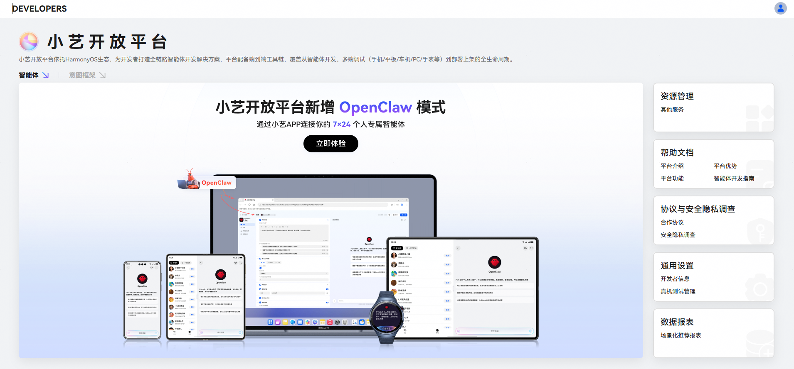
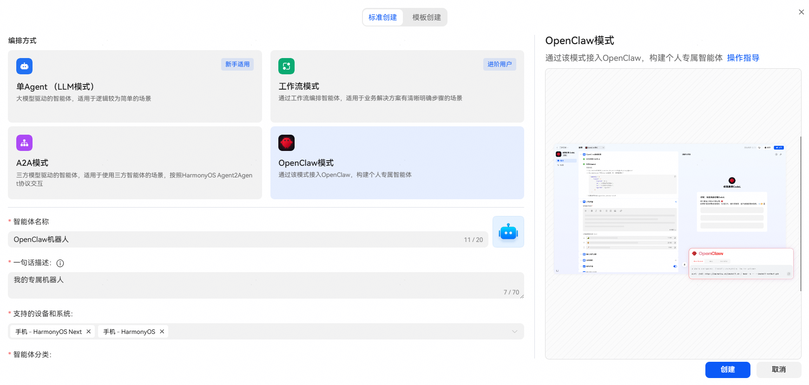

# 即时通信合集配置指南

本文档只讲各平台官方后台如何配置，以及这些字段如何回填到 Home Assistant。

## Home Assistant 侧

1. 将本仓库部署到 HA 的 `custom_components/cn_im_hub`。
2. 重启 Home Assistant。
3. 进入 `设置 -> 设备与服务 -> 添加集成`，搜索 `即时通信合集`。
4. 首次添加时只创建 Hub，并选择一次全局 `agent_id`。
5. 进入该集成页面，点击“添加服务/添加子项”，再按平台分别填写凭据。

说明：`agent_id` 是集成级配置，不需要每个平台重复填写。

## Feishu（飞书）

1. 创建企业自建应用。  
   
2. 在“凭证与基础信息”获取 `App ID`、`App Secret`。  
   
3. 在“权限管理”授予消息收发权限（如 `im:message:readonly`、`im:message:send_as_bot`）。  
   
4. 在“事件订阅”选择 WebSocket 长连接并添加 `im.message.receive_v1`，然后发布应用。  
   
5. 回到 HA 填写：`app_id`、`app_secret`。

## WeCom（企业微信）

1. 进入“智能机器人”创建机器人。  
   
2. 接入模式选 `API`，接入方式选“长连接”。  
   
3. 在详情页保存 `bot_id` 与 `secret`。  
   
4. 确认机器人具备收发消息能力。
5. 回到 HA 填写：`bot_id`、`secret`。

## QQ（QQ 开放平台机器人）

1. 打开 QQ 开放平台并登录：`https://q.qq.com/qqbot/openclaw/login.html`。  
   
2. 点击“创建机器人”，完成后记录 `AppID` 与 `AppSecret`。  
   
3. 在 QQ 端做一次聊天验证，确认机器人已发布可用。  
   
4. 本集成使用 Gateway WebSocket。
5. 回到 HA 填写：`qq_app_id`、`qq_client_secret`。

## DingTalk（钉钉）

1. 登录钉钉开发者后台，进入“应用开发”创建应用。  
   
2. 填写应用基础信息并保存，确认应用已出现在应用列表。  
   
   
3. 在“凭证与基础信息”记录 `Client ID` 与 `Client Secret`。  
   
4. 在“添加应用能力”中添加机器人能力，并确认消息接收模式为 Stream。  
   
   
   
5. 在权限管理中添加权限：`Card.Streaming.Write`、`Card.Instance.Write`、`qyapi_robot_sendmsg`，然后创建新版本并发布。  
   
   
   
6. 把机器人添加到目标群进行联调，确认机器人可回复。  
   
   
7. 回到 HA 填写：
   - `dingtalk_client_id`
   - `dingtalk_client_secret`

## WeChat（个人微信）

重点：`个人微信支持多人绑定`。

1. 在 HA 集成页面添加 `WeChat` 子服务。
2. 页面会显示二维码或二维码链接。
3. 扫码确认后保存当前微信账号凭据，并启用长轮询。
4. 如需绑定多个微信号，重复添加 `WeChat` 子服务并再次扫码。
5. 当前个人微信实现基于腾讯 `openclaw-weixin` 的登录与长轮询协议。

## XiaoYi（小艺）

1. 登录小艺开放平台，进入智能体平台后点击左上角“+创建智能体”。  
   
2. 按官方流程填写名称、头像、描述、分类和设备信息，选择 `OpenClaw` 模式创建智能体。  
   
3. 进入“OpenClaw基础配置”，如果还没有凭证，先到“工作空间 -> 凭证”新建 Key，并保存 `AK/SK`。  
   
4. 回到智能体配置页，完成服务器 channel 配置，并记录 `agentId`。  
   
5. 回到 HA 填写：`ak`、`sk`、`agent_id`。

## 常见检查项

- 平台凭据正确，且后台已发布/启用机器人能力。
- HA 端已配置全局 `agent_id`。
- 平台子服务已在集成页面添加成功。
- HA 主机网络可以访问平台接口。
