# 中国即时通信合集

把中国常见即时通信平台聚合到一个 Home Assistant 集成中。

## 当前支持

- Feishu
- WeCom
- QQ（WebSocket 网关）
- DingTalk（Stream 模式）

## 当前实现

- 添加集成时只配置一次全局 `agent_id`
- 各平台通过 subentry 独立添加、独立更新
- 消息统一走自然语言会话（conversation agent）

## 在 Home Assistant 里的设置

### 1) 安装集成

1. 将本仓库部署到 HA 的 `custom_components/cn_im_hub`。
2. 重启 Home Assistant。
3. 进入 `设置 -> 设备与服务 -> 添加集成`，搜索 `中国即时通信合集`。
4. 添加时通过下拉列表选择一次全局 `agent_id`（后续所有平台共用）。

### 2) 首次添加行为

- 首次添加只创建 Hub，不会自动启用任何 IM 平台。

### 3) 在集成页面添加服务（Subentry）

1. 进入 `设置 -> 设备与服务 -> 中国即时通信合集`。
2. 在该集成页面点击“添加服务/添加子项”。
3. 选择要添加的平台：`Feishu` / `WeCom` / `QQ` / `DingTalk`。
4. 填写该平台凭据并保存。
5. 每个平台是一个独立服务项，可单独进入设置更新或删除。

注意：`agent_id` 是集成级必填项，不需要每个平台重复填写。

### 4) HA 服务

- `cn_im_hub.send_message`
  - 参数：`provider`、`target`、`target_type`、`message`
- `cn_im_hub.test_conversation`
  - 参数：`provider`、`text`

## 平台后端设置

说明：以下步骤均为当前已支持并已接入的配置方式。

### Feishu（飞书）

1. 创建企业自建应用。  
   
2. 在“凭证与基础信息”获取 `App ID`、`App Secret`。  
   
3. 在“权限管理”授予消息收发权限（如 `im:message:readonly`、`im:message:send_as_bot`）。  
   
4. 在“事件订阅”选择 WebSocket 长连接并添加 `im.message.receive_v1`，然后发布应用。  
   
5. 回到 HA 填写：`app_id`、`app_secret`。

### WeCom（企业微信）

1. 进入“智能机器人”创建机器人。  
   
2. 接入模式选 `API`，接入方式选“长连接”。  
   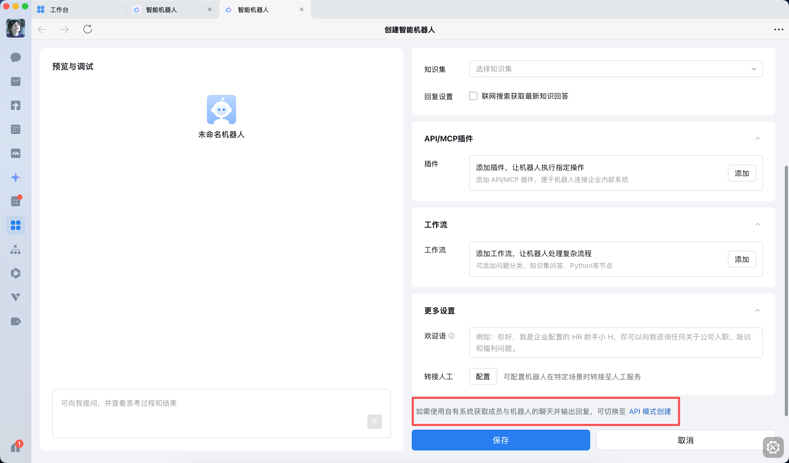
3. 在详情页保存 `bot_id` 与 `secret`。  
   
4. 确认机器人具备收发消息能力。
5. 回到 HA 填写：`bot_id`、`secret`。

### QQ（QQ 开放平台机器人）

（来自 Hello Claw 第三章，按本集成字段映射）

1. 打开 QQ 开放平台并登录：`https://q.qq.com/qqbot/openclaw/login.html`。  
   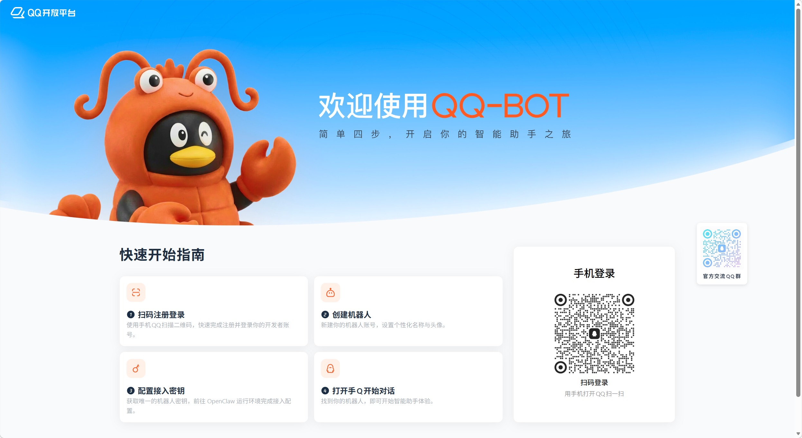
2. 点击“创建机器人”，完成后记录 `AppID` 与 `AppSecret`。  
   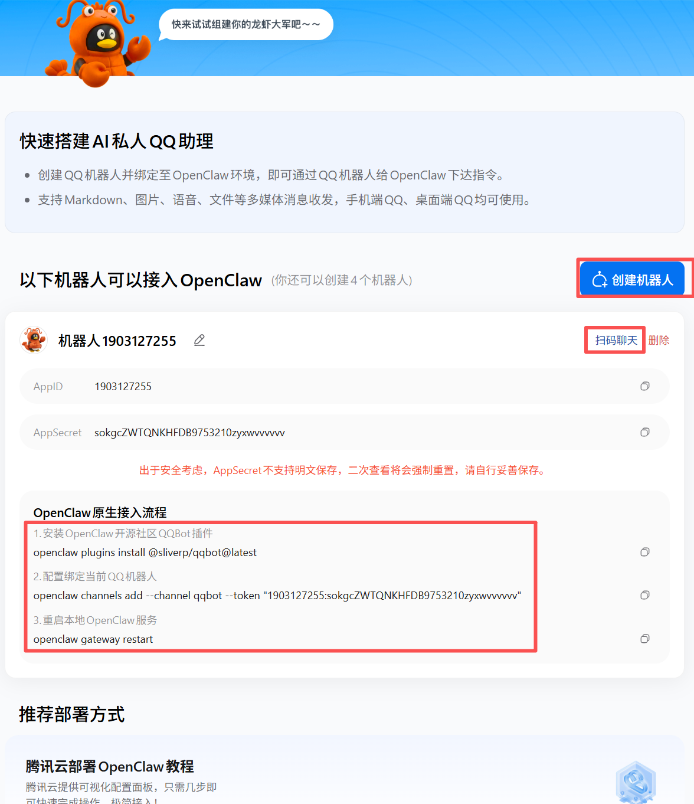
3. 在 QQ 端做一次聊天验证，确认机器人已发布可用。  
   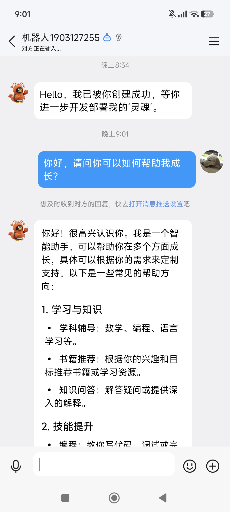
4. 本集成使用 Gateway WebSocket。
5. 回到 HA 填写：`qq_app_id`、`qq_client_secret`。

### DingTalk（钉钉）

（基于钉钉官方文档《将 OpenClaw 接入钉钉，创建你的 AI 助理员工》）

1. 登录钉钉开发者后台，进入“应用开发”创建应用。  
   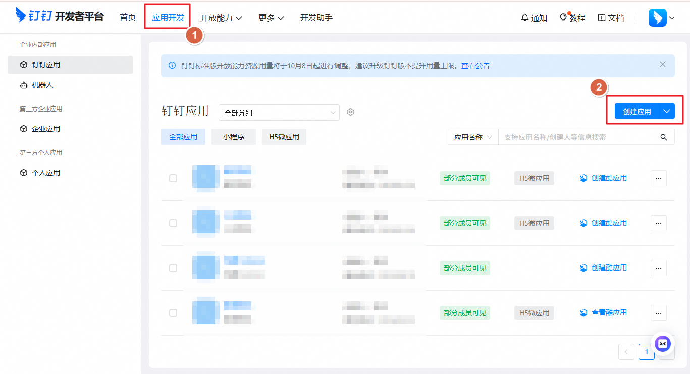
2. 填写应用基础信息并保存，确认应用已出现在应用列表。  
   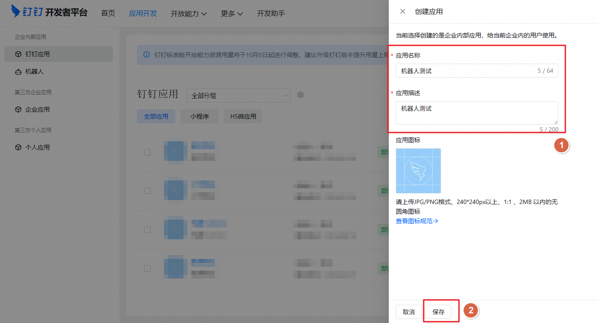
   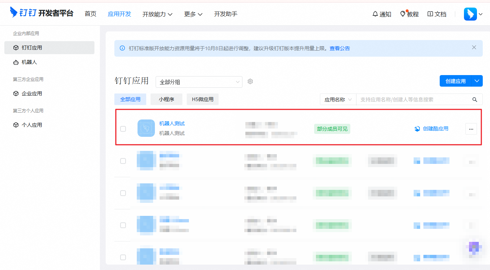
3. 在“凭证与基础信息”记录 `Client ID` 与 `Client Secret`。  
   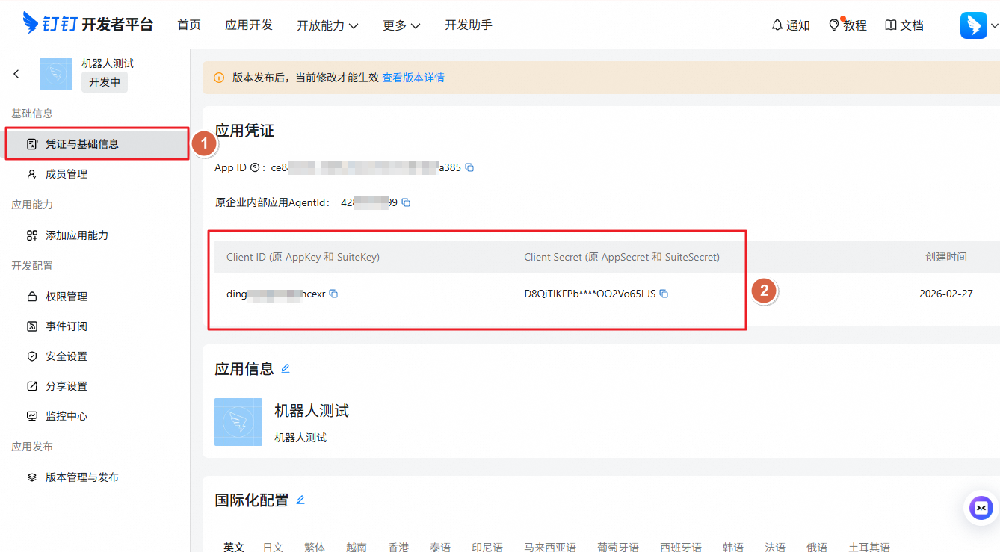
4. 进入应用详情，在“添加应用能力”中添加机器人能力，并在机器人配置中确认消息接收模式为 Stream。  
   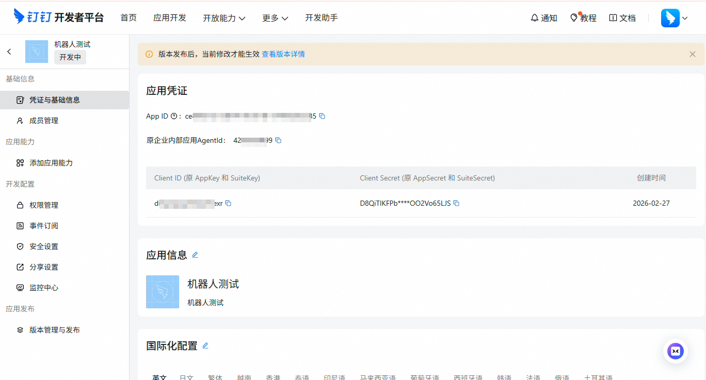
   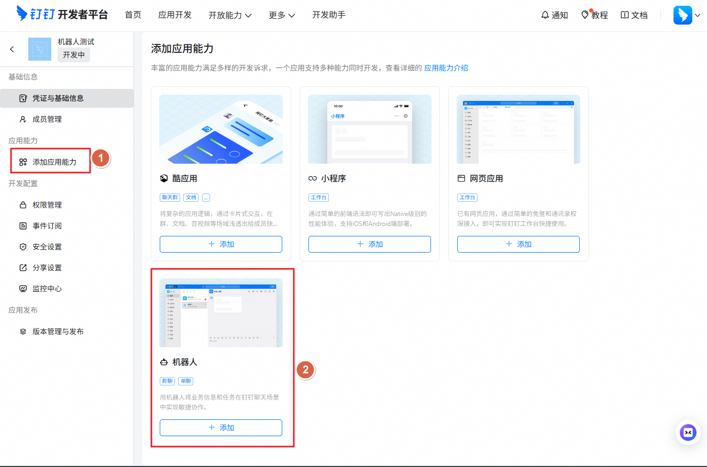
   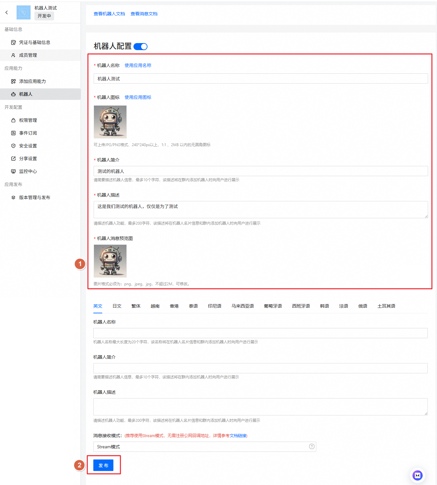
5. 在权限管理中添加权限：`Card.Streaming.Write`、`Card.Instance.Write`、`qyapi_robot_sendmsg`，然后创建新版本并发布。  
   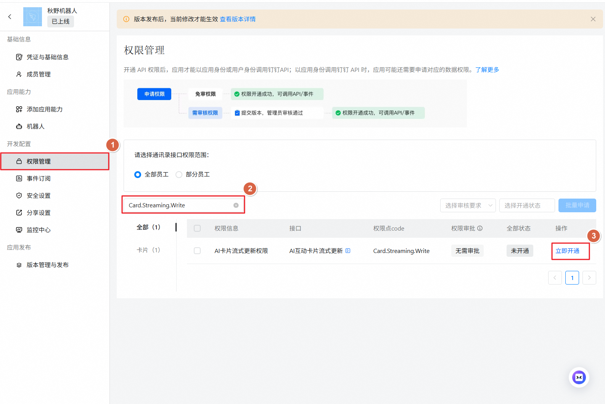
   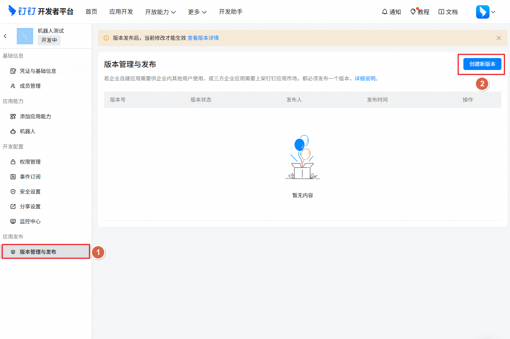
   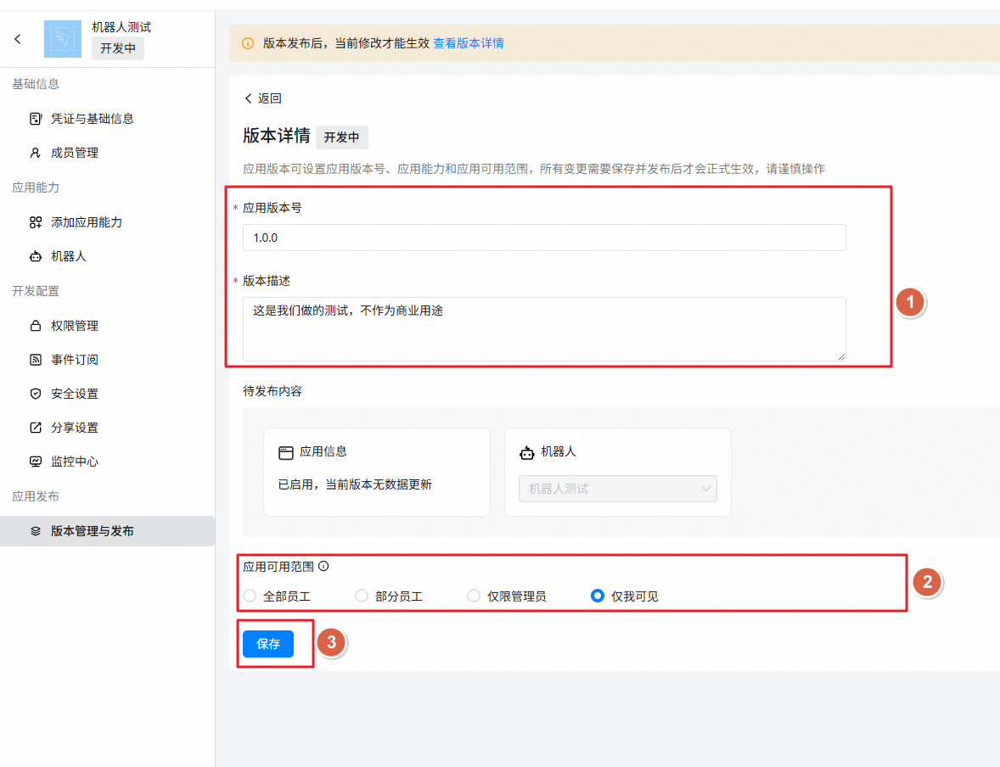
6. 把机器人添加到目标群进行联调，确认机器人可回复。  
   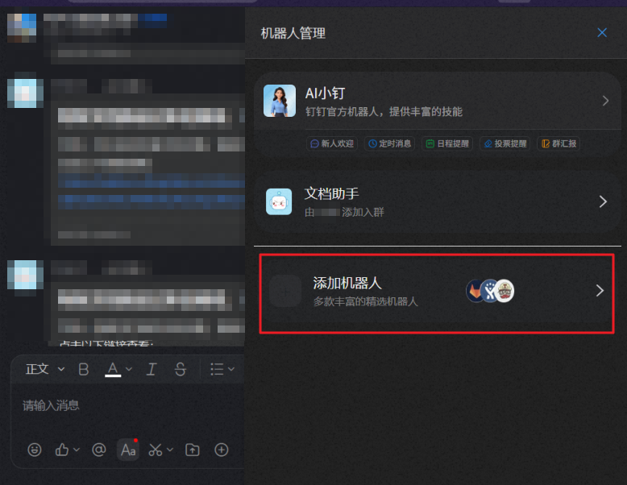
   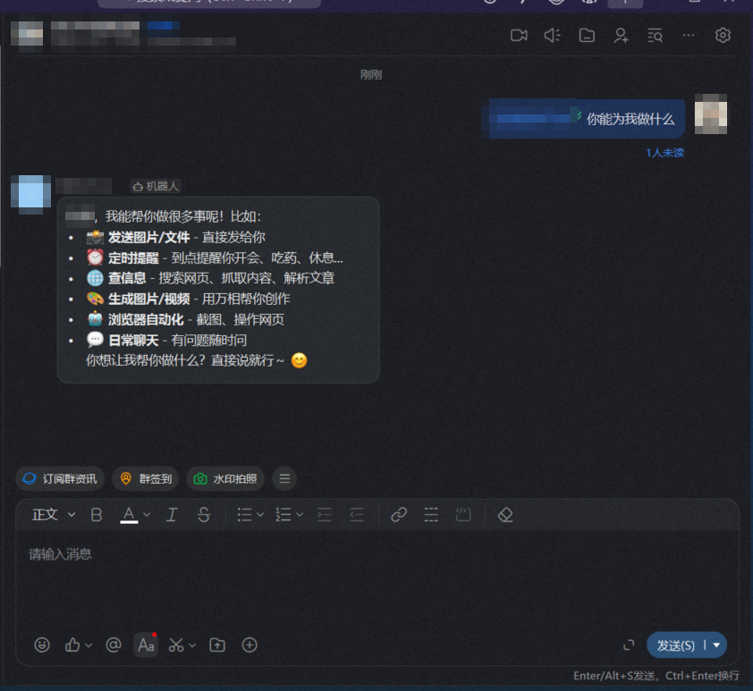
7. 回到 HA，在 DingTalk 子服务填写：
   - `dingtalk_client_id` = 钉钉 `Client ID`
   - `dingtalk_client_secret` = 钉钉 `Client Secret`

常见踩坑（钉钉）：

- 已创建应用但收不到消息：通常是未安装到组织，或机器人未加入目标会话。
- 凭据正确但发送失败：优先检查权限是否完整，以及应用是否已发布。
- 能发不能收：优先检查是否启用了 Stream 长连接。

## 联调检查清单

- HA 端已选全局 `agent_id`，且该 agent 可正常对话。
- 平台服务已作为独立 subentry 添加成功。
- 平台凭据正确，且后台已发布/启用机器人能力。
- 网络可从 HA 主动访问平台接口（飞书、企微、QQ、钉钉）。
- 所有平台子服务均已在集成页面成功添加。

## 参考来源

- Hello Claw 第三章（QQ 机器人流程）：
  `https://datawhalechina.github.io/hello-claw/cn/adopt/chapter3/`
- ha-feishu（飞书后台配置与截图）：
  `https://github.com/ha-china/ha-feishu`
- ha_wecom（企微后台配置与截图）：
  `https://github.com/ha-china/ha_wecom`
- 钉钉官方文档（OpenClaw 接入）：
  `https://open.dingtalk.com/document/dingstart/build-dingtalk-ai-employees`

## 目标地址格式（send_message）

- `feishu`：`target_type` 常用 `chat_id`，`target` 填 chat_id
- `wecom`：`target` 填 chatid 或可达目标
- `qq`：建议使用 `user:<openid>` / `group:<group_openid>` / `channel:<channel_id>`
- `dingtalk`：`target_type=user` 填用户 ID；`target_type=group` 填群会话 ID

## 对话方式

- 自然语言对话。
- 消息会统一转到集成级配置的 `agent_id` 对应的 HA conversation agent。
